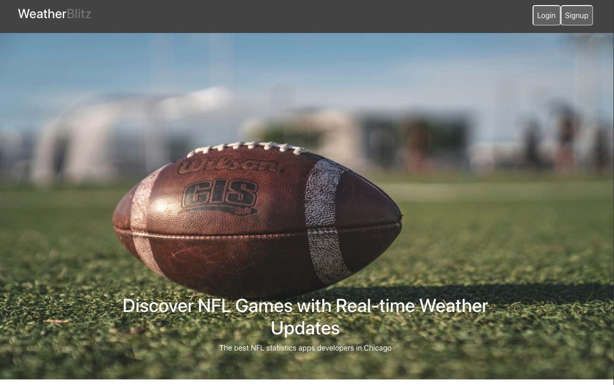
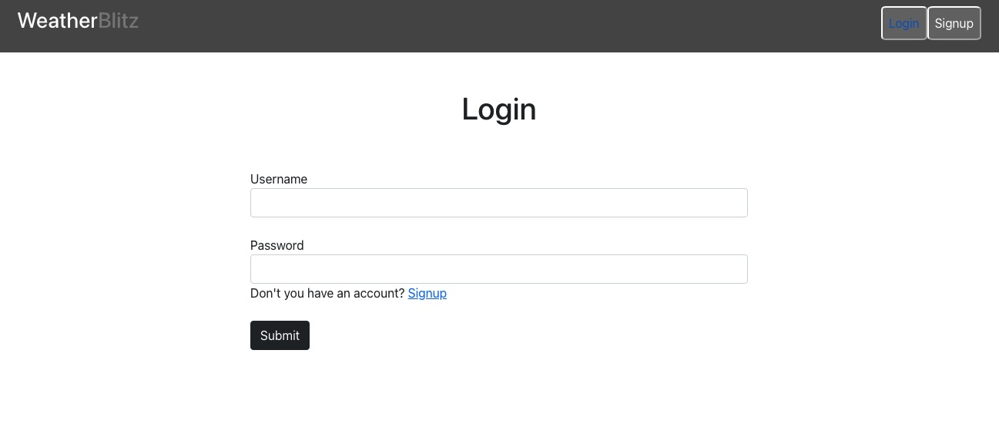
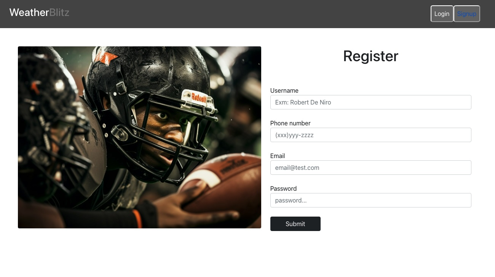

# Weather Blitz

## Description
The NFL Game Day Weather Tracker allows a user to see the weather forecast for a given NFL game. When a user logs in, the NFL season schedule is shown with the details for each game including date, teams playing, location, and weather data if available. If a given game is more than 5 days away, weather forecast data will not be available, and instead the user will see an error message. This application uses OpenWeatherAPI to retrieve weather data and NFL API Data from RapidAPI to retrieve the NFL data. 

## User Story
```md
AS A football fan
I WANT A website where I can see the schedule of NFL football games and their weather forecasts
SO THAT I can see the weather forecast for the games I am planning to watch
I WANT to create an account on the NFL Weather website
SO THAT I can log in and securely access the content on the website
I WANT to favorite games 
SO THAT I can quickly access the weather forecast for games I am planning to watch
```

## Acceptance Criteria
```md
WHEN I open the application website
THEN I am shown the home page, prompting me to log in or register as a user
WHEN I choose register
THEN I am taken to a form prompting me to enter my username, phone number, email, and password 
WHEN I enter my login credentials
THEN I am taken to a page with the NFL season schedule with information on the teams playing in each game, the date of the game, the game’s location, and the game’s weather forecast (if available) 
WHEN a game is within 5 days from the current date
THEN I am shown the weather forecast for the date and location of the game
WHEN a game that is more than 5 days in the future or has already been played
THEN I am shown an error message stating that weather data is not available more than 5 days in advance. 
WHEN I am inactive for more than 1 hour and then return to the page
THEN I am prompted to log in again to refresh the json web token
```

## Technologies
This website uses JWT to authenticate users. 
Node.js and Express.js were used to create the API.
React was used to build the user interface
PostgreSQL and Sequelize were to used to create and manage the database
Render was used to deploy the final application
OpenWeather API was used to retrieve the weather data
NFL API from RAPID API was used to retrieve the NFL data

## Screenshots

Home Page


Log In 


Register


Events page


## Deployed Application
You can view the deployed application [here]()